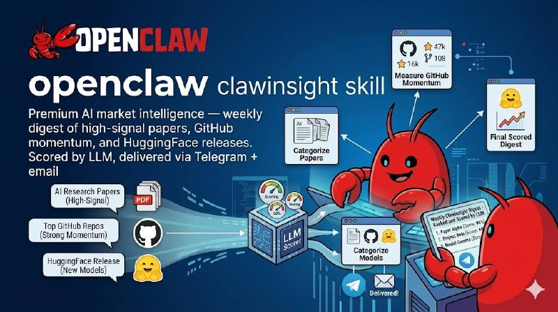

<p align="center">
  
</p>

<h1 align="center">🧠 Market Monitor</h1>
<h3 align="center">Premium AI Market Intelligence for OpenClaw Agents</h3>

<p align="center">
  <strong>Weekly digest of high-signal AI papers, GitHub momentum, and HuggingFace releases.</strong><br/>
  Scored by LLM. Delivered via Telegram + email. Built for AI strategists.
</p>

<p align="center">
  arXiv · HuggingFace · GitHub Trending · AlphaSignal<br/>
  Two-stage filter: keyword pre-screen + Claude Haiku relevance scoring<br/>
  Author reputation boost · Borderline strategic check · Full synthesis
</p>

<div align="center">

[](LICENSE)
[](https://github.com/yhyatt/MarketMonitor)
[](https://clawhub.ai/skills/market-monitor)
[](https://github.com/yhyatt/MarketMonitor/actions)

</div>

<p align="center">
  <a href="#-openclaw-friendly">OpenClaw 🦞</a> •
  <a href="#-what-it-does">What It Does</a> •
  <a href="#-quick-start">Quick Start</a> •
  <a href="#-configuration">Configuration</a> •
  <a href="#-filter-tuning">Filter Tuning</a> •
  <a href="#-architecture">Architecture</a> •
  <a href="#-cron-setup">Cron Setup</a>
</p>

---

## 🦞 OpenClaw Friendly

Market Monitor is an OpenClaw skill. Install it and your agent handles the weekly scan automatically:

```bash
clawhub install yhyatt/market-monitor
```

Or run manually:

```bash
python3 -m market_monitor run --telegram YOUR_CHAT_ID --email you@example.com
```

---

## ✨ What It Does

<table>
<tr>
<td width="50%">

### 📡 Four Sources
- **arXiv** — cs.AI, cs.LG, cs.CL, cs.MA (200 papers/week)
- **HuggingFace** — Daily papers + trending models by 7-day likes
- **GitHub Trending** — Weekly star velocity for tracked AI repos + live trending scrape
- **AlphaSignal** — Parses your AlphaSignal email digest from Gmail as a cross-check

</td>
<td width="50%">

### 🎯 Two-Stage Filter
- **Stage 1:** Keyword pre-filter (50+ positive signals, 8 negative signals)
- **Stage 2:** Claude Haiku LLM scoring (0–10) with structured JSON output
- **Author boost:** +1 for known high-signal researchers (Karpathy, Khattab, Agüera y Arcas, etc.)
- **Borderline check:** Items scoring 6–7 get a focused strategic second-pass (~150 tokens)

</td>
</tr>
<tr>
<td width="50%">

### 🚀 Smart Delivery
- **Telegram:** Compact digest, auto-splits at 4,000 chars
- **Email:** Rich HTML, mobile-responsive, sections per source
- **Synthesis:** One LLM call generates "Why this week matters" paragraph with enterprise framing

</td>
<td width="50%">

### 💾 Persistent Store
- `memory/market/papers.jsonl` — arXiv papers with scores + signals
- `memory/market/hf_releases.jsonl` — HuggingFace items
- `memory/market/github_signals.jsonl` — GitHub velocity signals
- Deduplication across runs — never surfaces the same item twice

</td>
</tr>
</table>

---

## 🚀 Quick Start

### 1. Clone & install

```bash
git clone https://github.com/yhyatt/MarketMonitor.git
cd MarketMonitor
pip install -r requirements.txt
```

### 2. Set environment variables

```bash
export ANTHROPIC_API_TOKEN=sk-ant-...      # Required: LLM scoring
export GOG_KEYRING_PASSWORD=your-password  # Required: Gmail delivery
export GITHUB_TOKEN=ghp_...               # Optional: higher rate limits (60→5000/hr)
```

### 3. Subscribe to AlphaSignal (free)

Go to [alphasignal.ai](https://alphasignal.ai) and subscribe. Create a Gmail label called `Digest_sources` and apply it to AlphaSignal emails. The collector picks them up automatically.

### 4. Run

```bash
# Full pipeline: scan + digest
python3 -m market_monitor run --telegram YOUR_CHAT_ID --email you@example.com

# Just scan (no delivery)
python3 -m market_monitor scan

# Just deliver (from stored items)
python3 -m market_monitor digest --telegram YOUR_CHAT_ID --email you@example.com

# Status
python3 -m market_monitor status

# Dry run
python3 -m market_monitor test
```

---

## ⚙️ Configuration

| Environment Variable | Required | Description |
|---|---|---|
| `ANTHROPIC_API_TOKEN` | ✅ Yes | Anthropic API key for Claude Haiku scoring |
| `GOG_KEYRING_PASSWORD` | ✅ Yes | Password for gog Gmail CLI keyring |
| `GITHUB_TOKEN` | Optional | GitHub Personal Access Token (raises rate limit from 60→5,000/hr) |

### Gmail setup (for email delivery)

This skill uses [`gog`](https://github.com/openclaw/gog) for Gmail. Make sure `gog` is authenticated with send scope:

```bash
GOG_KEYRING_PASSWORD=your-password gog auth add your@gmail.com
```

---

## 🔍 Filter Tuning

The two-stage filter is tuned for an AI strategist audience. Adjust in `market_monitor/filters/`:

### High-interest topics (score 8–10)
- Agentic AI, multi-agent systems, orchestration
- Auto-research: autonomous scientific discovery, deep research agents
- Open-source LLMs and frameworks (LLaMA, Mistral, Gemma, DeepSeek, vllm, dspy)
- Paradigm shifts, foundation model positioning
- Human-AI collaboration, enterprise deployment architecture

### Deprioritized (score lower unless major)
- Security vulnerabilities — only systemic/novel threats score 8+
- Narrow benchmarks, incremental improvements
- Domain-specific NLP (medical, geographic, etc.)

### Author reputation boost
Researchers on the `HIGH_SIGNAL_RESEARCHERS` list in `scorer.py` get +1 to their score, pushing borderline papers (6→7) over the inclusion threshold. Add or remove names to tune.

### Borderline strategic check
Items scoring 6–7 after the main scoring pass get a focused second-pass prompt (~150 tokens) asking: *"Is there a concrete strategic implication for enterprise AI adoption, market positioning, or paradigm shift?"* This can bump a 6→7 (include) or drop a 7→6 (exclude).

---

## 🏗️ Architecture

```
┌─────────────────────────────────────────────────────────────────┐
│                        COLLECTORS                                │
│  ┌──────────┐  ┌──────────────┐  ┌────────────┐  ┌───────────┐ │
│  │  arXiv   │  │ HuggingFace  │  │   GitHub   │  │AlphaSignal│ │
│  │  API     │  │ API + likes7d│  │  Trending  │  │  Gmail    │ │
│  └────┬─────┘  └──────┬───────┘  └──────┬─────┘  └─────┬─────┘ │
└───────┼───────────────┼─────────────────┼──────────────┼───────┘
        │               │                 │              │
        ▼               ▼                 ▼              ▼
┌─────────────────────────────────────────────────────────────────┐
│                         FILTERS                                  │
│  ┌────────────────┐  ┌──────────────────┐  ┌─────────────────┐  │
│  │ Keyword Filter │─▶│   LLM Scorer     │─▶│  Deduplicator   │  │
│  │ (stage 1)      │  │  + author boost  │  │                 │  │
│  │                │  │  + strategic     │  │                 │  │
│  │                │  │    check (6-7)   │  │                 │  │
│  └────────────────┘  └──────────────────┘  └─────────────────┘  │
└─────────────────────────────────────────────────────────────────┘
        │
        ▼
┌─────────────────────────────────────────────────────────────────┐
│                          STORE                                   │
│  papers.jsonl  ·  hf_releases.jsonl  ·  github_signals.jsonl    │
└─────────────────────────────────────────────────────────────────┘
        │
        ▼
┌─────────────────────────────────────────────────────────────────┐
│                         DIGEST                                   │
│  ┌──────────────┐  ┌─────────────────┐  ┌────────────────────┐  │
│  │  Synthesizer │  │    Formatter    │  │     Delivery       │  │
│  │ (why this    │  │ Telegram + HTML │  │ Telegram · Email   │  │
│  │  week matters│  │                 │  │                    │  │
│  └──────────────┘  └─────────────────┘  └────────────────────┘  │
└─────────────────────────────────────────────────────────────────┘
```

---

## ⏰ Cron Setup

### OpenClaw cron (recommended)

```
python3 -m market_monitor run --telegram 5553808416 --email you@gmail.com
```

Schedule: Sundays 19:00 local time. The isolated agent runs in a clean context.

### System cron

```bash
0 19 * * 0 cd /path/to/workspace && ANTHROPIC_API_TOKEN=sk-ant-... GOG_KEYRING_PASSWORD=... python3 -m market_monitor run --telegram YOUR_CHAT_ID --email you@gmail.com
```

---

## 🧪 Tests

```bash
pip install pytest pytest-mock
python3 -m pytest tests/ -v
```

100 tests, 0 external API calls required (all mocked).

---

## 📄 License

MIT — see [LICENSE](LICENSE)

---

<p align="center">
  Built with 🦞 <a href="https://openclaw.ai">OpenClaw</a> · Published on <a href="https://clawhub.ai/skills/market-monitor">ClawHub</a>
</p>
